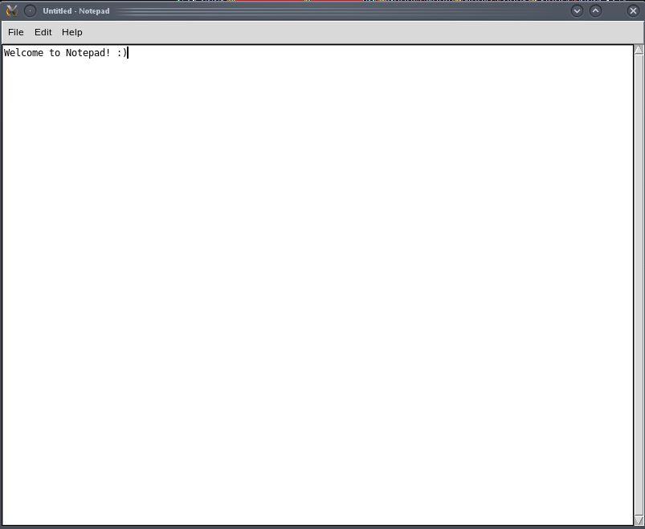

# Notepad

This application is a basic version of Windows 10 Notepad, and can be run on Unix.
Written in Python3.

Made by [Eugeny Khanchin](https://github.com/eKhanchin) as a personal project.
## Screenshot

